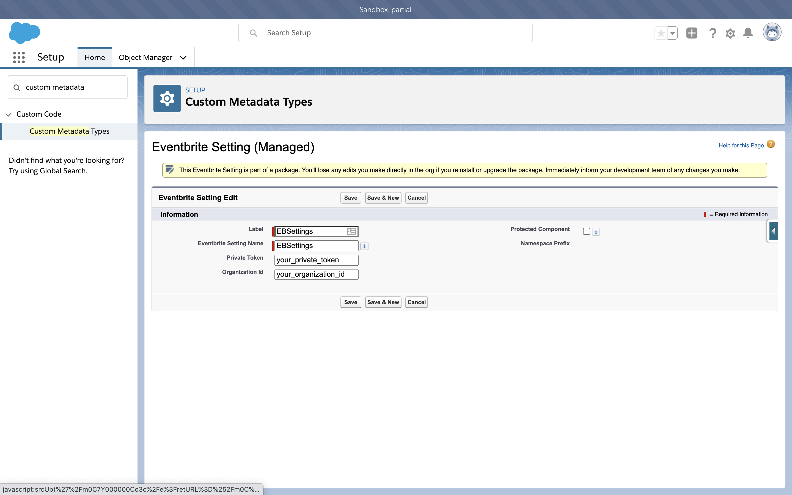
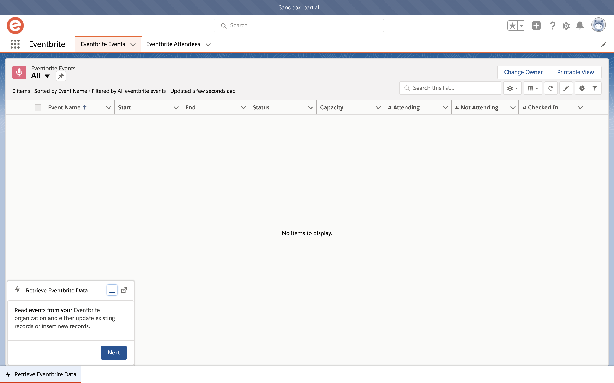
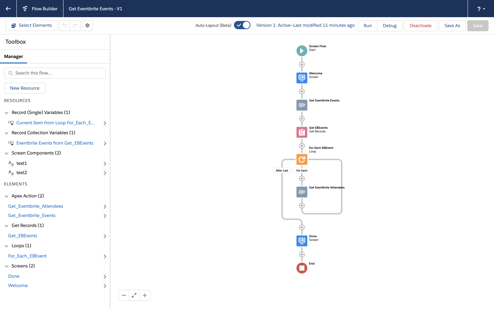

# Salesforce Eventbrite Integration

[/badge.svg?branch=main>)](https://github.com/tegeling/salesforce-eventbrite/actions?query=workflow%3A%22Salesforce+DX+%28scratch+org%29%22) 

This repository contains Salesforce SFDX resources to integrate Salesforce with Eventbrite and retrieve event and attendee records.
It retrieves records from Eventbrite via Rest API and stores records in Salesforce custom objects. Use the new Eventbrite App to retrieve data via flow embedded in a utility bar.

Installation link for Sandbox Orgs
https://test.salesforce.com/packaging/installPackage.apexp?p0=04t5I000001mslhQAA

Installation link for Production Orgs
https://login.salesforce.com/packaging/installPackage.apexp?p0=04t5I000001mslhQAA

# Setup Instructions

After you have successfully deployed the package or sources, additional setup steps are required.

## Retrieve Private Token from Eventbrite

The API uses Rest based webservices with authorization based on private token.
To get a private token follow these steps:

1. Log in to your Eventbrite account and visit [your API Keys page](https://www.eventbrite.com/platform/api-keys).
2. Copy your **private token**.

## Get your Eventbrite organization id

Events are listed and published by organization members. You can find your **organization id** via API calls - it is different from your organizer id! Keep that in mind when configuring your integration.

See https://www.eventbrite.com/platform/docs/organizations for more details.

## Update Custom Metadata record

In Salesforce Setup you find under `Custom Metadata Type` an entry for `Eventbrite Setting`. Open `Manage Records` and edit the entry `EBSettings`.
Enter and save your values for **Organization Id** and **Private Token** from above.

# How to use Salesforce Eventbrite Integration

After you have finished the setup steps you are ready to use the integration.
This package provides integration with [Eventbrite Events](https://www.eventbrite.com/platform/api#/reference/event) and [Eventbrite Attendees](https://www.eventbrite.com/platform/api#/reference/attendee).

## Eventbrite Events via Apex

Use Apex class [`EBEvents`](https://github.com/tegeling/salesforce-eventbrite/blob/main/force-app/main/default/classes/EBEvents.cls) to retrieve all events from your specific organization. The required input parameter contains the custom metadata record developer name. The return value is an Apex class [`EBSchema.EBEventsList`](https://github.com/tegeling/salesforce-eventbrite/blob/main/force-app/main/default/classes/EBSchema.cls) containing all Eventbrite event data including the unique event id.
The records are upserted into custom object `EBEvent__c`.

## Eventbrite Attendees via Apex

Use Apex class [`EBAttendees`](https://github.com/tegeling/salesforce-eventbrite/blob/main/force-app/main/default/classes/EBAttendees.cls) to retrieve all attendees from a specific event. The required input parameter contains the custom metadata record developer name and the event id from the previous call.
The return value is an Apex class [`EBSchema.EBAttendeeList`](https://github.com/tegeling/salesforce-eventbrite/blob/main/force-app/main/default/classes/EBSchema.cls) containing all attendee records.
The recoords retrieved are upserted into custom object `EBAttendee__c`.

## Use a flow to retrieve data from Eventbrite

This solution provides a flow to invoke the Apex classes. The sample flow retrieves all Eventbrite events and then iterates over all events and retrieves the attendees for each event.

